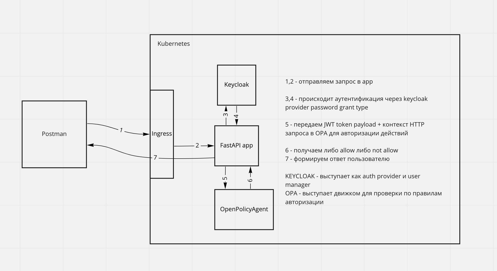

# OpenAPI generated FastAPI server

This Python package is automatically generated by the [OpenAPI Generator](https://openapi-generator.tech) project:

- API version: 1.0.0
- Build package: org.openapitools.codegen.languages.PythonFastAPIServerCodegen

## Requirements.

Python >= 3.7

## Running local k8s

Протестировано для MacOS

**Внимание: на вашем хосте должен быть свободен порт `80`**

1. Необходимо установить `docker`
2. Для запуска исполнить `./start.sh`. (занимает порядка 5 минут при первоначальном запуске, так как keycloak стартует долго)
3. Для очистки от локального кластера `./stop.sh`

После запуска кластера доступны следущие URL:
- `http://localhost` - само приложение
- `http://keycloak.localhost` - keycloak admin ui (admin/admin)
- `http://prom.localhost` - prometheus
- `http://grafana.localhost` - grafana
- `http://opa.localhost` - open policy agent


Если необходимо подкючение к кластеру через `kubectl` -  исполните скрипт `connect.sh`.

## Postman collection

Коллекция лежит в файле `User Service.postman_collection.json`. 

Коллекция преднастроена для работы с кластером, запущенным через `./start.sh`.

## СХЕМА




# DEPRECATED все что ниже

## Running local with kubernetes

1. Install dependencies
```bash
brew install helm kubectl helmfile  minikube
minikube start --vm=true --driver=hyperkit
```
2. **(Optional)** Build docker image and load it in minikube
```bash
docker build -t otus-homework-6 .
minikube image load otus-homework-6:latest --daemon=true --overwrite=true
```
3. Install ingress
```bash
helm upgrade --install ingress-nginx ingress-nginx \
  --repo https://kubernetes.github.io/ingress-nginx \
  --namespace ingress-nginx --create-namespace \
  --set controller.service.externalIPs={$(minikube ip)}
```
4. Helm install command  
```bash
cd helm/homework-6
kubectl config set-context minikube
helm repo add postgresql https://cetic.github.io/helm-charts
helm dependency build
helm upgrade otus-homework-6 ./ --install --wait
```
5. Configure `/etc/hosts`
```bash
echo "$(kubectl get ing otus-homework-6 -o jsonpath='{.status.loadBalancer.ingress[0].ip}') arch.homework" | sudo tee -a /etc/hosts
```
6. Check using postman collection in file `User Service.postman_collection.json`

## Running with Docker-compose

To run the server on a Docker container, please execute the following from the root directory:

```bash
docker-compose up --build
```

